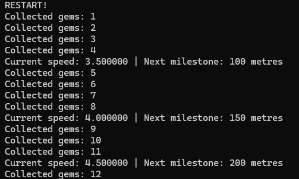
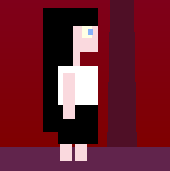
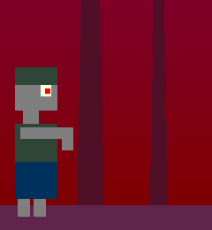
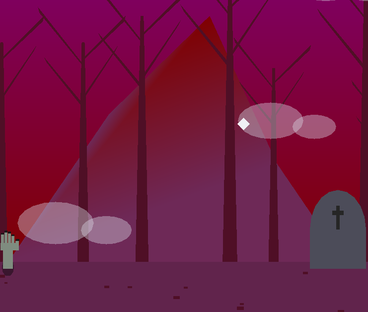
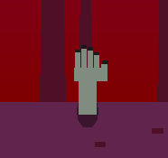
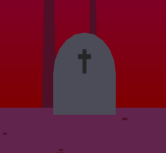
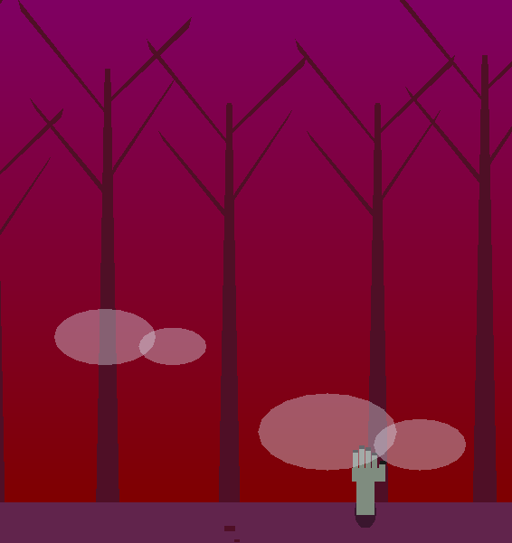

# GraveRun! - 2D Animation & Gameplay Demo


<video src="https://github.com/user-attachments/assets/bd96e62b-9c2e-4328-b7d0-eaba643600eb" autoplay loop muted style="max-width: 100%;"></video>

## Project Overview
**GraveRun!** is an interactive 2D endless runner where the player must escape a chasing zombie while navigating a procedurally generated graveyard. The project focuses on real-time animation, physics-based movement, and dynamic gameplay systems using C++ and OpenGL.

## Project Objectives

The objective of this project was to develop an **interactive 2D digital animation demo**. Beyond the visual composition, the development focused on implementing custom shaders and real-time logic. 

The project was designed to meet and exceed the following technical criteria:

* **Artistic Direction & Visual Impact**: High emphasis on the scene's aesthetic coherence and overall visual engagement.
* **Physics-Based Animation**: Implementation of animations driven by **kinematics and dynamics** simulations rather than simple pre-defined paths.
* **Core Gameplay Mechanics**: Integration of functional gameplay elements, including defined **win/loss conditions** for the player.
* **Particle Systems**: Development of real-time particle effects to enhance the environmental feedback and visual polish.

While code organization was flexible for the assignment, this repository follows a **modular structure** to demonstrate industry-standard practices in game engine architecture.
*Developed as part of the Fundamentals of Computer Graphics course in Computer Engineering in Alma Mater Studiorum, Bologna, Italy.*

## Gameplay Mechanics

The game features a side-scrolling environment where the objective is to survive as long as possible. Players earn points by covering distance and collecting **gems items** scattered throughout the path.

### Obstacles
To survive, the player must react to two distinct types of hazards:
* **The Headstone**: A static obstacle that requires a timed jump to clear.
* **The Zombie Hand**: An emerging hazard that sprouts from the ground; the player must navigate around or over it without making contact.

### Difficulty Scaling
To ensure a challenging experience, the game implements a **dynamic difficulty system**. The run is divided into **50-meter milestones**. Every time a milestone is reached, the side-scrolling speed increases, demanding faster reflexes for both obstacle avoidance and item collection.

### Real-Time Statistics
Player performance is tracked in real-time. Metrics such as meters traveled and items collected are updated and displayed via the **Command-Line Interface (CLI)** for immediate feedback.

<p align="center">
  
  <br><i>Real-time statistics tracking distance, collection, and speed updates.</i>
</p>

## Controls

The movement system allows for precise control over the character's position and speed:

| Key | Action |
| :--- | :--- |
| **W** | Jump (Parabolic trajectory) |
| **A** | Step Backward |
| **D** | Step Forward |
| **Shift** | Sprint |
| **R** | Restart Game |

## Graphical Implementation & Asset Creation

All game elements and complex geometries in **GraveRun!** were procedurally generated from simple geometric primitives. The project utilizes helper functions such as `draw_plan()` and `draw_triangle()` (defined in `init_geometrie.cpp`). I extended the provided codebase with custom helpers, including `draw_circle()` and `draw_quad()`, to support more diverse and detailed shapes.

### Asset & Scenery Breakdown

The visual style focuses on a stylized, block-based aesthetic, utilizing transparency and gradients to add depth:

* **Dynamic Sky**: Instead of a flat color, the sky features a vertical gradient achieved through color interpolation between deep red and dark purple.
* **Character Design**:
    * **Protagonist**: A stylized female figure constructed from a series of assembled rectangles forming the head, torso, and limbs, with details like black hair and blue eyes.
    * **The Zombie**: Built with a similar modular block structure but utilizing a desaturated palette (grays and sickly greens) to emphasize its undead nature.
* **Environmental Assets**:
    * **Trees**: Stylized bare structures composed of quadrilaterals forming the trunk and branches.
    * **Mountains**: Polygonal shapes created by joining triangles to produce non-uniform slopes. Dual-tone coloring (base vs. peak) is used to enhance the sense of depth.
    * **Clouds**: Formed by overlapping two circles, scaled along the Y-axis for a more organic look. An **alpha channel ($< 1$)** is used to provide realistic transparency.
* **Interactive & Gameplay Elements**:
    * **Headstones**: Composed of a rectangular base and a semi-circular top, featuring a cross-shaped detail.
    * **Zombie Hands**: Detailed assemblies of multiple rectangles representing the palm, fingers, and nails, emerging from a circular "hole" primitive.
    * **Collectibles (Gem)**: Diamond-shaped items created by joining two triangles.
    * **Particles**: Individual white square primitives used for real-time visual effects.
 
<table align="center">
  <tr>
    <td align="center">
      <br />
      <sub><b>Main Protagonist</b></sub>
    </td>
    <td align="center">
      <br />
      <sub><b>Chasing Zombie</b></sub>
    </td>
    <td align="center">
      <br />
      <sub><b>Mountain</b></sub>
    </td>
  </tr>
  <tr>
    <td align="center">
      <br />
      <sub><b>Zombie Hand</b></sub>
    </td>
    <td align="center">
      <br />
      <sub><b>Headstone</b></sub>
    </td>
    <td align="center">
      <br />
      <sub><b>Trees</b></sub>
    </td>
  </tr>
</table>

## Technical Implementation: Physics & Mechanics

The game's movement system is built upon a custom physics engine that manages real-time kinematics, gravity simulations, and viewport constraints.

### 1. Kinematics & Side-Scrolling Movement
To create the illusion of a continuous world, all objects in the scene—including the player—are subject to a constant leftward translation. However, the protagonist retains independent horizontal control, allowing for free movement along the X-axis to dodge obstacles or increase the distance from the chasing zombie.

### 2. Parabolic Jump Model
The jumping mechanic is handled through a discrete physical simulation of a parabolic trajectory:

* **Initial Impulse**: When the jump key ('W') is pressed while the character is grounded, a high positive value is assigned to the `verticalSpeed` variable, representing the initial upward thrust.
* **Gravity Simulation**: During the flight phase, a fixed gravitational constant is subtracted from `verticalSpeed` in every frame.
* **Zenith & Descent**: The character reaches the peak of the arc when `verticalSpeed` hits zero for a single frame. Subsequently, the velocity becomes increasingly negative, simulating a realistic accelerated descent until ground contact is re-established.

### 3. Viewport Constraints (Invisible Walls)
To maintain gameplay integrity, the character's coordinates are strictly clamped within the window boundaries:
* **Vertical Bound**: The jump height is mathematically capped to ensure the player remains within the visible viewport.
* **Horizontal Clamping**: A boundary check is performed on the X-axis. If the character's position exceeds the window limits, it is locked using the following logic: 
  `posxCharacter = width - CHARACTER_WIDTH`.

## Endless World & Procedural Generation

To achieve the "endless runner" experience and provide the illusion of an infinite environment, the game implements a continuous update loop for background and foreground elements. This system relies on a few key computer graphics techniques:

### 1. Seamless Scrolling & Parallax Mechanics
* **Coordinate Wrapping (Duplication)**: Background elements utilize two coordinate sets, `dx1` and `dx2`. While `dx1` starts at $x=0$, `dx2` is offset to $x=width$ (the window's width), effectively "stitching" the textures together.
* **Frame-by-Frame Translation**: Both coordinate variables are decremented every frame based on the current game velocity.
* **Automatic Reset**: As soon as a coordinate set completely exits the viewport, it is instantly teleported to the end of the active set, ensuring a flawless, infinite loop.
* **Parallax Depth Simulation**: To enhance the sense of scale, distant scenery (like mountains) scrolls at a lower speed relative to the foreground, creating a realistic sense of depth.

### 2. Procedural Spawning Logic
Unlike static background elements, mountains and obstacles appear at randomized intervals. This is managed through an **Object Pooling** approach:
* An array of objects is pre-allocated, each with an `isActive` flag.
* A `mountain_timer` (or `obstacle_timer`) manages spawning; when it expires, the program searches for an inactive object and re-initializes it outside the right screen boundary with randomized dimensions.

### 3. Dynamic Obstacle Spawner (C++)
The obstacle logic is more complex as it manages different entity types—Headstones, Zombie Hands, and Gems—each with distinct randomized properties.

```cpp
if (obstacle_timer <= 0) {
    for (int i = 0; i < MAX_OBSTACLES; i++) {
        if (!obstacles[i].isActive) {
            obstacles[i].isActive = true;

            // Randomly select obstacle type
            if (rand() % 3 == 0) {
                obstacles[i].type = HAND;
                obstacles[i].width = 50.0f;
                obstacles[i].height = 75.0f;
            }
            else {
                obstacles[i].type = HEADSTONE;
                obstacles[i].width = 100 + rand() % 30;
                obstacles[i].height = 120 + rand() % 70;
            }

            // Position the obstacle just outside the right viewport
            obstacles[i].x = width + 100.0f;
            obstacles[i].y = gameplayGroundLine;

            // Reset spawn timer with a random variance
            obstacle_timer = 1.2f + (rand() % 30) / 10.0f;
            break;
        }
    }
}
```

## Collision Detection & Resolution System

The game implements a collision system based on **AABB (Axis-Aligned Bounding Boxes)** to manage interactions between the protagonist and various game entities.

### 1. Collision Logic Overview
The core logic resides within the `update()` function, which continuously monitors the spatial relationship between the player and active obstacles. For every active object, the system calculates its bounding box; if an overlap with the player's bounding box is detected, a collision event is triggered.

### 2. Entity-Specific Interactions
Collisions are interpreted differently depending on the object type:
* **Collectibles (Gem)**: Positive interaction. The item is deactivated (`isActive = false`), the score increments, and a particle effect is triggered for visual feedback.
* **Lethal Hazards (Zombie & Hands)**: Negative interaction. The system sets a global `hit` flag to `true`, effectively triggering the Game Over state.
* **Environment (Headstones)**: Context-aware interaction. The result depends on the point of impact:
    * **Top Impact**: Allows the player to land and walk on top of the headstone, treating it as a platform.
    * **Lateral Impact**: The headstone acts as a solid wall, blocking the player's horizontal progression.

### 3. Headstone Collision Implementation (C++)
The following snippet demonstrates the logic used to distinguish between "landing" on a headstone and "hitting" it from the side. This is achieved by checking the player's vertical velocity and previous frame position.

```cpp
float headstoneMargin = 15.0f;
float headstoneLeft = obsLeft + headstoneMargin;
float headstoneRight = obsRight - headstoneMargin;

// Case 1: Character lands on top of the headstone
if (verticalSpeed <= 0 && prevCharBottom >= obsTop 
    && charRight > headstoneLeft && charLeft < headstoneRight) {

    posyCharacter = obsTop;        // Snap to top surface
    verticalSpeed = 0;             // Reset fall velocity
    isGrounded = true;             // Enable jumping again
    isStandingOnObstacle = true;
}
// Case 2: Lateral collision (Character hits the side)
else if (!goingUp) {
    float fromLeft = charRight - obsLeft;
    float fromRight = obsRight - charLeft;

    // Resolve overlap by pushing the character out of the obstacle
    if (fromLeft < fromRight) {
        posxCharacter -= fromLeft;
    } else {
        posxCharacter += fromRight;
    }
}
```
### 4. Enemy-Environment Interaction
To emphasize the zombie's unstoppable nature, a specific collision logic is applied to the enemy NPC. When the zombie collides with any environmental obstacle (such as headstones), the object is immediately deactivated (`isActive = false`). This creates the visual impression of the creature destroying everything in its path, adding to the game's atmosphere and threat level.

## VFX: Real-Time Particle System

To provide satisfying visual feedback during gameplay, specifically for item collection, I implemented a custom **Particle System**. This system simulates a small "magical" explosion whenever the player collects a glitter item.

<p align="center">
  
</p>

### Technical Implementation: Object Pooling
Following industry best practices for memory management and performance, the system utilizes **Object Pooling**:
* **Pre-allocation**: A fixed-size array of particles is allocated at startup, with all entities initially set to an inactive state.
* **Emission**: When an item is collected, the `emit_particles()` function is triggered. It resets and activates a group of particles, positioning them at the center of the collected item.
* **Dynamics & Lifespan**: The `update_particles()` function manages the real-time behavior of each active particle. It calculates their outward dispersion using velocity vectors and monitors their **TTL (Time To Live)**. Once a particle's short lifespan expires, it is automatically deactivated and returned to the pool for future use.

## Repository Structure

```text
.
├── img/                          # Visual documentation (screenshots and demos)
├── assets/
│   └── shaders/                  # OpenGL Shading Language (GLSL) source files
├── include/
│   ├── gestione_callback.h       # Callback definitions
│   ├── lib.h                     # General headers and dependencies
│   └── ShaderMaker.h             # Shader utility header
├── src/
│   ├── glad.c                    # OpenGL loader library
│   ├── gestione_callback.cpp     # Input handling (mouse/keyboard)
│   ├── init_geometrie.cpp        # 2D geometry drawing
│   ├── ShaderMaker.cpp           # Shader utility implementation
│   └── LAB_2_2D_ZOMBIE.cpp       # Main application logic
├── .gitattributes                # Git configuration for path attributes
├── LICENSE                       # Project license terms
└── README.md                     # Project documentation and setup guide
```
